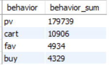
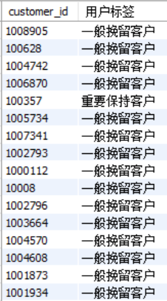

# 淘宝用户行为分析

[下载pdf报告](https://github.com/yoasaaa/TB-UserBehavior-SQL-Excel/blob/main/%E6%B7%98%E5%AE%9D%E7%94%A8%E6%88%B7%E8%A1%8C%E4%B8%BA%E5%88%86%E6%9E%90%E6%8A%A5%E5%91%8A.pdf)


# 一、项目背景
浏览、收藏、加购物车、购买是电商最基础环节，本项目通过对用户这四个行为数据的分析，描述了电商网站运营现状，并从中探索用户行为规律，希望能将这些规律与营销策略相结合，以实现更精准的营销，达到提高销售额的目的。

UserBehavior 是阿里巴巴提供的一个淘宝用户行为数据集，包含了 2017 年 11 月 25 日至 2017 年 12 月 3 日之间，有行为的约一百万随机用户的所有行为（行为包括浏览、收藏、加购物车、购买），本案例选取了其中 20 万条数据进行分析，其中数据包含如下 5 个数据字段：

|   列名称         <font color=#ff0000> </font>   |   说明                                            |
|:---------------------------------------------|:------------------------------------------------|
|   customer_id                                |   整数类型，序列化后的用户ID                                |
|   goods_id                                   |    整数类型，序列化后的商品ID                               |
|   category                                   |    整数类型，序列化后的商品所属类目ID                           |
|   behavior                                   |  字符串，枚举类型，包括('pv', 'buy', 'cart', 'fav')        |
|   tsp                                        |   行为发生的时间戳                                      |  

数据来源：[淘宝用户购物行为数据集_数据集-阿里云天池](https://tianchi.aliyun.com/dataset/649)


# 二、提出问题及分析思路
本项目通过 SQL 分析数据，导出结果至 Excel，利用 Excel 实现数据可视化。以下为本项目分析思路：

按照以上分析思路，解决以下几个问题：
1. 流量的数量和质量如何？
2. 访客的转化率如何？是否需要进一步提高客户留存率？
3. 用户有哪些行为习惯或消费偏好值得注意？用户活动时间规律和商品偏好是什么？
4. 哪些用户是高价值用户？如何维护高价值用户的忠诚度？


# 三、数据清洗
## 1. 选择子集
选取数据集中 20 万条数据，通过 NAVICAT 导入 Mysql 进行分析。

## 2.列名重命名
原数据集中没有列名，手动增加列名：customer_id, goods_id, category, behavior

## 3.删除重复值
```sql
select customer_id,goods_id,category,behavior,tsp
from userbehavior 
group by customer_id,goods_id,category,behavior,tsp
having count(*) > 1;
```
导入的数据集中没有重复值。

## 4. 缺失值处理
```sql
select count(customer_id),count(goods_id),count(category),count(behavior),count(tsp)
from userbehavior; 
```
在创建表格，设置了所有字段都是“not null”, 并通过 count 函数检验，导入的数据中没有缺失值

## 5.一致化处理
原数据中时间戳的格式为 unix timestamp，需要转换格式。将其拆分为日期和时间，便于分析。
```sql
/*关闭safe-mode以执行修改命令*/
set SQL_SAFE_UPDATES = 0;  

/*增加一列用于将原数据中的时间格式转化为可读的格式*/
alter table userbehavior add column tsp1 timestamp(0);
update userbehavior
set tsp1 = from_unixtime(tsp) ;

/*将原数据中的日期和时间分开*/
alter table userbehavior add dates varchar(255);
update userbehavior 
set dates = from_unixtime(tsp,'%Y-%m-%d');
alter table userbehavior add times varchar(255);
update userbehavior
set times = from_unixtime(tsp,'%H:%i:%s');
```

## 6. 异常值处理
数据集中的数据是 2017 年 11 月 25 日至 2017 年 12 月 3 日，检查是否存在不在这一时间范围内的数据，删除范围外的数据。
```sql
/*先用select语句查找要删除的数据，防止误删
select tsp1
from userbehavior
where tsp1 < '2017-11-25 00:00:00' or tsp1 > '2017-12-04 00:00:00';*/

delete from userbehavior
where tsp1 < '2017-11-25 00:00:00' or tsp1 > '2017-12-04 00:00:00';

/*检验剩下数据是否有异常*/
select min(tsp1),max(tsp1)
from userbehavior;
```
经检验，处理后的所有数据都符合时间范围。


# 四、构建模型及可视化
## 1. 数据集整体概况
```sql
select
	count(customer_id) as 数据总数,
	count(distinct customer_id) as 用户数,
	count(distinct goods_id) as 商品数量,
	count(distinct category) as 商品类型数量,
    sum(if (behavior='pv',1,0)) as 点击次数,
    sum(if (behavior='fav',1,0)) as 收藏次数,
	sum(if (behavior='cart',1,0)) as 加购次数,
	sum(if (behavior='buy',1,0)) as 购买次数
from userbehavior;
```
执行结果：


本项目分析了 2017 年 11 月 25 日至 2017 年 12 月 3 日这 9 天内的 199908 条记录中，1973 名用户对 3980 个类目下的 117032 件商品进行的点击（179739）、收藏（4934）、加购（10906）和购买（4329）行为。

## 2. 流量指标分析
### 2.1 人均页面访问量 PV/UV
```sql
select 
	count(distinct customer_id) as 'UV',
    (select count(customer_id) from userbehavior where behavior='pv') as 'PV',
    (select PV) / count(distinct customer_id) as 'PV/UV'
from userbehavior;
```
执行结果：


### 2.2 跳出率=仅点击页面用户数/总用户数 UV
```sql
select count(distinct customer_id)/(select count(distinct customer_id) from userbehavior) as 'bounce_rate'
from userbehavior
where customer_id not in (select customer_id from userbehavior where behavior = 'buy') and 
    customer_id not in (select customer_id from userbehavior where behavior = 'cart') and
    customer_id not in (select customer_id from userbehavior where behavior = 'fav');
```
执行结果：

仅点击页面却没有收藏、加入购物车或购买的用户比例为 6.69%，说明平台对用户的吸引力较高，平台的用户流量质量较高。

### 2.3 人均成交量=订单量/用户总数
```sql
select count(customer_id)/(select count(distinct customer_id) from userbehavior) as 人均成交量
from userbehavior
where behavior = 'buy';
```
执行结果：

人均成交量为 2.19%

## 3. 用户行为分析
### 3.1 用户行为整体情况分析
```sql
select behavior,count(*) as behavior_sum
from userbehavior
group by behavior
order by behavior_sum desc;
```
执行结果：



对所有用户行为进行汇总分析，最终购买的用户数约占所有行为的  2.2%(200000/4329)，而点击行为约占总体的 90%（179739/200000）。点击后收藏加购的转化率为 8.8%，收藏加购后购买的转化率为 27.3%。
说明平台有产品堆砌展示的问题，使得用户花费极多的时间在寻找和筛选商品上。
因此需要优化平台产品推荐功能，将产品更多信息直接显示在首页上，并可以更精准地推荐符合用户偏好的产品。

### 3.2 独立访客转化率
```sql
select behavior,count(distinct customer_id) as behavior_sum
from userbehavior
group by behavior
order by behavior_sum desc;
```
执行结果：


对独立访客的行为进行分析，从一开始的点击页面到最终购买的转化率约为 69.6%（1369/1967），说明独立用户购买欲望充足。

## 4. 用户行为模式分析
### 4.1 每日用户访客量、点击量、成交量
```sql
select 
	dates as 日期,
    count(distinct customer_id) as 日访客量,
    sum(if(behavior='pv',1,0)) as 日点击量,
    sum(if(behavior='buy',1,0)) as 日成交量
from userbehavior
group by dates
order by dates;
```
执行结果：


从 11 月 25 日至 12 月 3 日的每日用户点击量（pv）数据显示，12 月 2 日用户点击量激增，推测 12 月 2 日平台进行了营销活动。
虽然日访客量较以往有所上升，但成交量上升微弱，成交率不升反降。
其中原因可能有以下几种：a.本次的营销活动方式、渠道、营销的产品等对用户的吸引力不够；b.本次营销活动针对的用户群体范围不广，且平台本身对用户个性化需求的抱把握不够。

### 4.2 各时段用户点击量统计
```sql
select
	sum(if (times between '00:00:00' and '00:59:59',1,0)) as '0~1',
    sum(if (times between '01:00:00' and '01:59:59',1,0)) as '1~2',
	sum(if (times between '02:00:00' and '02:59:59',1,0)) as '2~3',
    sum(if (times between '03:00:00' and '03:59:59',1,0)) as '3~4',
    sum(if (times between '04:00:00' and '04:59:59',1,0)) as '4~5',
    sum(if (times between '05:00:00' and '05:59:59',1,0)) as '5~6',
    sum(if (times between '06:00:00' and '06:59:59',1,0)) as '6~7',
    sum(if (times between '07:00:00' and '07:59:59',1,0)) as '7~8',
    sum(if (times between '08:00:00' and '08:59:59',1,0)) as '8~9',
    sum(if (times between '09:00:00' and '09:59:59',1,0)) as '9~10',
    sum(if (times between '10:00:00' and '10:59:59',1,0)) as '10~11',
    sum(if (times between '11:00:00' and '11:59:59',1,0)) as '11~12',
    sum(if (times between '12:00:00' and '12:59:59',1,0)) as '12~13',
    sum(if (times between '13:00:00' and '13:59:59',1,0)) as '13~14',
    sum(if (times between '14:00:00' and '14:59:59',1,0)) as '14~15',
    sum(if (times between '15:00:00' and '15:59:59',1,0)) as '15~16',
    sum(if (times between '16:00:00' and '16:59:59',1,0)) as '16~17',
    sum(if (times between '17:00:00' and '17:59:59',1,0)) as '17~18',
    sum(if (times between '18:00:00' and '18:59:59',1,0)) as '18~19',
    sum(if (times between '19:00:00' and '19:59:59',1,0)) as '19~20',
    sum(if (times between '20:00:00' and '20:59:59',1,0)) as '20~21',
    sum(if (times between '21:00:00' and '21:59:59',1,0)) as '21~22',
    sum(if (times between '22:00:00' and '22:59:59',1,0)) as '22~23',
    sum(if (times between '23:00:00' and '23:59:59',1,0)) as '23~24'
from userbehavior
where behavior = 'pv';
```
执行结果：


用户在 19 点至 23 点的活跃度最高，点击量在晚上 21 点至 22 点这个时间段达到峰值。将各时段点击量与购买量对照分析如下。可见用户购买波峰也集中在 19 至 23 点。因此，平台可以在这个时间段进行营销活动，以此提高用户的点击量和成交量。
另外，在 10-11，13-14，16-17 这三个时段购买量也出现峰值，可以在这些时段通过一定的营销活动促成更多成交量。


## 5. 商品指标分析
### 5.1 不同商品的购买情况
```sql
create view goodsbuytimes as
select goods_id,count(customer_id) as buytimes
from userbehavior
where behavior = 'buy'
group by goods_id;

select buytimes as 复购次数,count(goods_id) as 商品数量
from goodsbuytimes
group by buytimes
order by buytimes;

/*复购次数超过五次的商品*/
select goods_id as 商品,buytimes as 复购次数
from goodsbuytimes
where buytimes>=5
order by buytimes desc;
```
执行结果：


只购买一次的商品数量最多。在用户购买的商品种类共 4007 种，用户复购的商品种类约占总体的 6.7%（(4007-3738)/4007 ）。说明存在较强竞争性的产品很少。


购买次数不少于 5 次的商品只有商品编号为 4157341 和 1542908 的商品比较受欢迎。

### 5.2 不同商品类目购买情况
```sql
create view categorybuytimes as
select category,count(customer_id) as buytimes
from userbehavior
where behavior = 'buy'
group by category;

select buytimes as 复购次数,count(category) as 商品类目数量
from categorybuytimes
group by buytimes
order by buytimes;

/*复购次数超过60次的商品*/
select category as 商品类目,buytimes as 复购次数
from categorybuytimes
where buytimes>=60
order by buytimes desc;
```


在 1312 个不同类型的商品中，有 678 个商品类目只被购买过一次。用户会重复购买的商品类型比例为 48.3%（(1312-678)/1312）。
用户购买次数超过 60 次、受用户欢迎的商品类型有1464116，2735466，2885642，4145813。
商品类型为 1464116 的复购次数最多为 71 次，最受用户欢迎。

### 5.3 Top20 商品
```sql
/*点击Top20商品*/
select goods_id,count(*) as sum
from userbehavior
where behavior = 'pv'
group by goods_id
order by sum desc
limit 20;

/*加购Top20商品*/
select goods_id,count(*) as sum
from userbehavior
where behavior = 'cart'
group by goods_id
order by sum desc
limit 20;

/*收藏Top20商品*/
select goods_id,count(*) as sum
from userbehavior
where behavior = 'fav'
group by goods_id
order by sum desc
limit 20;

/*购买Top20商品*/
select goods_id,count(*) as sum
from userbehavior
where behavior = 'buy'
group by goods_id
order by sum desc
limit 20;
```

## 6. 用户价值分析
### 6.1 RFM 模型简介
RFM 模型可以衡量客户价值和客户创造利益的能力，该模型通过客户的最近一次消费 (Recency)、消费频率 (Frequency)、消费金额 (Monetary) 来描述客户的价值。
R（Recency）表示用户最近一次消费距离现在的时间。消费时间越近的客户价值越大。
F（Frequency）消费频率是指用户在统计周期内购买商品的次数，经常购买的用户价值肯定比偶尔来一次的客户价值大。
M（Monetary）消费金额是指用户在统计周期内消费的总金额，体现了消费者为企业创利的多少，消费越多的用户价值越大。

由于本数据集没有用户消费金额数据，只能统计 R 和 F，将用户分成以下四类。

|          | R（最近一次消费时间）高 | R（最近一次消费时间）低 |
|:---------|:-------------|:-------------|
| F（消费频率）高 | 重要价值客户       | 重要保持客户       |
| F（消费频率）低 | 一般发展用户       | 一般挽留用户       |  

高、低维度常以平均值和中位数区分。由于电商场景，大部分数据都呈现长尾分布，80%甚至 90%以上都集中在低频低额区间，少数的用户提供了大部分销售，采用平均数无法很好的体现数据集的特性，所以选择中位数作为区分标准。

F值和用户价值成正比，大于中位数为高维度，小于中位数为低纬度；
R 值和用户价值成反比，大于中位数为低纬度，小于中位数为高纬度。

### 6.2 R、F 值的计算
```sql
/*最后一次消费时间和消费频率*/
create view rfm as
select 
	customer_id,
    timestampdiff(hour,max(tsp1),'2017-12-04') as 最后一次购买时间,
    count(customer_id) 购买频率
from userbehavior
group by customer_id
order by 最后一次购买时间 desc;
```
执行结果：


计算 R、F 值中位数
```sql
/*计算R值中位数*/
select avg(最后一次购买时间) as R值中位数
from(
	select 
		最后一次购买时间,
        row_number() over (order by 最后一次购买时间) as rn,
        count(*) over() as n
    from rfm
) as r
where rn in (floor(n/2)+1,if(mod(n,2) = 0,floor(n/2),floor(n/2)+1));
```
执行结果：


```sql
/*计算F值中位数*/
select avg(购买频率) as F值中位数
from(
	select 
		购买频率,
        row_number() over (order by 购买频率) as rn,
        count(*) over() as n
    from rfm
) as f
where rn in (floor(n/2)+1,if(mod(n,2) = 0,floor(n/2),floor(n/2)+1));
```
执行结果：


### 6.3 利用 RFM 模型将用户分类
计算得到 R 值中位数为 4，F 值中位数为 75。用中位数界定高低维度并对用户分类。
```sql
/*用中位数界定高低维度并对用户分类*/
create view customertags as 
select 
	customer_id,
    (case when 最后一次购买时间<4 and 购买频率>75 then '重要价值客户'
    when 最后一次购买时间>=4 and 购买频率>75 then '重要保持客户'
    when 最后一次购买时间<4 and 购买频率<=75 then '一般发展客户'
    when 最后一次购买时间>=4 and 购买频率<=75 then '一般挽留客户'
    else null end) 用户标签
from rfm;
```
执行结果：


统计各类用户人数
```sql
select 用户标签,count(customer_id) as 人数
from customertags
group by 用户标签;
```
执行结果：


重要用户占50%，一般用户占50%。一般挽留用户占比最高，其次是重要价值用户，一般发展用户和中要保持用户次之。

### 6.4 高价值用户行为分析
对“重要价值客户“的行为进行分析，了解其购物偏好：
```sql
/*最受重要价值客户欢迎的商品*/
select goods_id,count(customer_id) as buytimes
from(
	select customer_id,goods_id
	from userbehavior
	where behavior = 'buy' and customer_id in (
		select customer_id 
		from customertags 
		where 用户标签='重要价值客户')
) as 重要价值客户购买商品
group by goods_id
order by buytimes desc;
```
执行结果：


```sql
/*最受重要价值客户欢迎的商品类型*/
select category,count(customer_id) as buytimes
from(
	select customer_id,category
	from userbehavior
	where behavior = 'buy' and customer_id in (
		select customer_id 
		from customertags 
		where 用户标签='重要价值客户')
) as 重要价值客户购买商品类型
group by category
order by buytimes desc;
```
执行结果：


在重要价值客户中，受欢迎程度排名前三的商品是 goods_id=1542908、667682、855191 ，受欢迎的商品类型排名前三的是 category=901282、1464116、2735466。因此，平台可以给这类高价值用户推荐相应的产品。


# 五. 结论及建议
通过上文的分析，结合AARRR漏斗模型作出以下总结及建议：

## 1. 获取客户（Acquisition）
1. 平台用户跳出率为 6.69%的数据就可看出，平台用户粘性不错，平台的用户流量质量较高。
2. 从 2017 年 12 月 2 日和 3 日点击量陡增的现象可见，平台的营销活动能吸引用户，有一定作用。
3. 用户点击量在晚上 21 点至 22 点达到峰值，且用户在 19 点至 23 点的活跃度最高。另外，在 10 至 11 点，13 至 14 点，16 至 17 点 这三个时段购买量也出现峰值，可以在这些时段通过一定的营销活动促成更多成交量。

## 2. 激活客户（Activation）
1. 虽然页面点击率高，但最后购买的用户数仅约占 2.2%，点击后收藏加购的转化率仅为 8.8%，说明平台有产品堆砌展示的问题，使得用户花费极多的时间在寻找和筛选商品上。因此需要优化平台产品推荐功能，将产品更多信息直接显示在首页上，并可以更精准地推荐符合用户偏好的产品。
2. 虽然 12 月 2 至 3 日点击量或因营销活动陡增，但最终购买量上升微弱，成交率不升反降。本次的营销活动方式、渠道、营销的产品等可能对用户的吸引力不够，或针对的用户群体范围不广

## 3. 留存用户（Retention）、
1. 商品编号为 4157341 和 1542908 的商品比较受欢迎，商品类型为 1464116 的商品最受用户欢迎，可以通过优惠活动和推送来提高用户重复购买率。
2. 通过 RFM 模型将用户分为重要价值客户、重要保持客户、一般发展客户、一般挽留客户。在重要价值客户中，受欢迎程度排名前三的商品是 1542908、667682、855191 ，受欢迎的商品类型排名前三的是 901282、1464116、2735466，平台可以给这类高价值用户推荐相应的产品。

## 4. 增加收入（Revenue）
- 对独立访客的行为进行分析，从一开始的点击页面到最终购买的转化率约为 69.6%，说明独立用户购买欲望充足。
- 在用户购买的商品种类共 4007 种，用户复购的商品种类约占总体的 6.7%；在 1312 个不同类型的商品中，用户会重复购买的商品类型比例为 48.3%，其中复购次数最多为 71 次。
- 虽然独立访客的转化率为 69.6%，但商品的复购率低。因此可以对高价值用户购买频率高的产品进行复购优惠活动。

## 5. 推荐传播（Referral）
可以通过邀请朋友砍价、分享领红包领和优惠券等方式，让用户主动分享和推荐，提高商品的曝光度。
